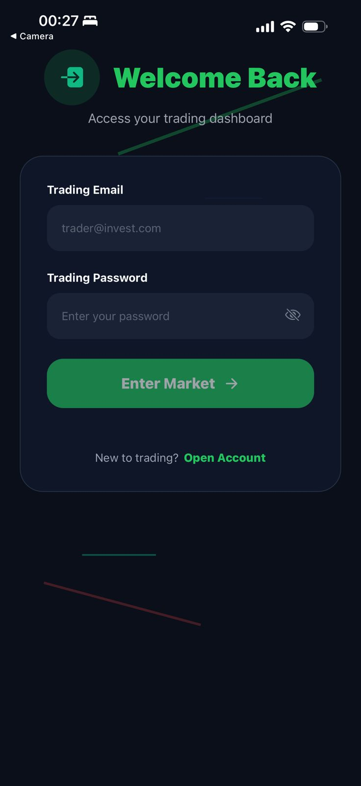
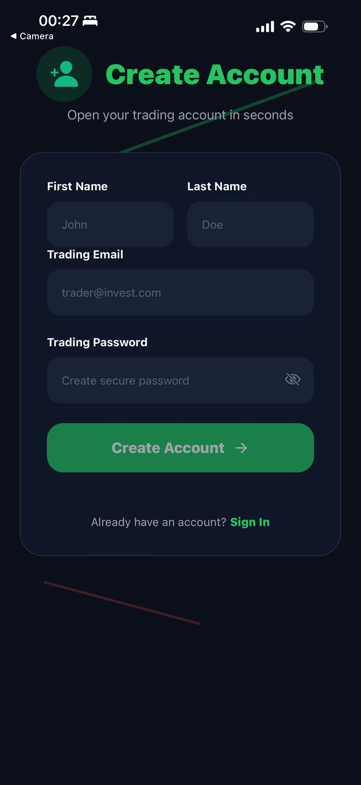
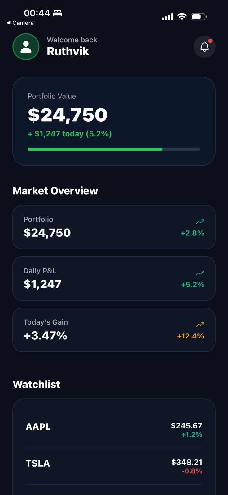
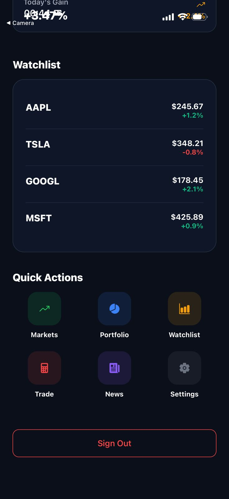
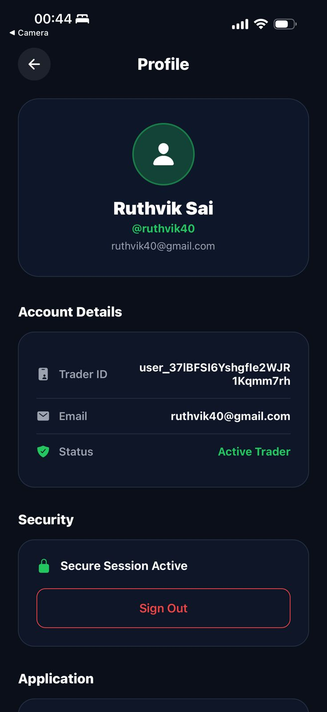
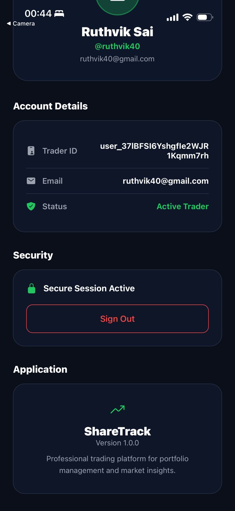

# 📈 ShareTrack – Trading & Portfolio Management App

A production-ready React Native trading dashboard application built with Expo and Clerk Authentication, providing secure user authentication, portfolio tracking, market insights, and a modern dark-themed trading experience.

<p align="center">
  
  
  
  
</p>

---
## ✅ Prerequisites

Make sure the following are installed on your system:

- **Node.js** (v18 or above recommended)
- **npm**
- **Expo Go app** (Android or iOS)
- A **Clerk account** for authentication keys

---

## 📥 Clone the Repository

```bash
git clone https://github.com/RuTHVik40/ShareTrack.git
cd ShareTrack
```

## 📦 Install Dependencies
```bash
npm install --legacy-peer-deps
```

## 🔐 Environment Configuration

Create a .env file in the root directory of the project and add:
```bash
EXPO_PUBLIC_CLERK_PUBLISHABLE_KEY=your_clerk_publishable_key
```
## Get Clerk Publishable Key

1. Go to https://dashboard.clerk.com
2. Select your application
3. Navigate to API Keys
4. Copy the Publishable Key

## ▶️ Run the Application

Start the Expo development server:
```bash
npx expo start
```

## 🗂️ Project Structure
```bash
ShareTrack/
├── app/
│ ├── (auth)/
│ │ ├── _layout.tsx
│ │ ├── sign-in.tsx
│ │ └── sign-up.tsx
│ ├── (home)/
│ │ ├── _layout.tsx
│ │ ├── index.tsx
│ │ └── profile.tsx
│ ├── _layout.tsx
│ └── styles.ts
├── components/
├── assets/
├── hooks/
├── constants/
├── .env
└── README.md
```

## ✨ Features

- 🔐 Secure authentication using Clerk (Email / Social Login)
- 📊 Portfolio overview with profit & loss insights
- 📈 Market watchlist with real-time styled UI
- 🌙 Modern dark-themed trading dashboard
- 👤 User profile management
- 📱 Fully responsive mobile-first design

## 📸 Application Output

## 🔐 Authentication Screens
<p align="center">
  
  
</p>

## 📊 Dashboard Screens
<p align="center">
  
  
</p>

## 👤 Profile Screens
<p align="center">
  
  
</p>
